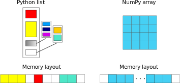
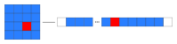
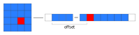
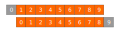

# Numpy – fast array interface

- Standard Python is not well suitable for numerical computations
    - lists are very flexible but also slow to process in numerical
      computations

- Numpy adds a new **array** data type
    - static, multidimensional
    - fast processing of arrays
    - tools for linear algebra, random numbers, *etc.*


# Numpy arrays

- All elements of an array have the same type
- Array can have multiple dimensions
- The number of elements in the array is fixed, shape can be changed


# Python list vs. NumPy array




# Creating numpy arrays

From a list:
```python
>>> import numpy
>>> a = numpy.array((1, 2, 3, 4), float)
>>> a
array([ 1., 2., 3., 4.])

>>> list1 = [[1, 2, 3], [4,5,6]]
>>> mat = numpy.array(list1, complex)
>>> mat
array([[ 1.+0.j, 2.+0.j, 3.+0.j],
       [ 4.+0.j, 5.+0.j, 6.+0.j]])

>>> mat.shape
(2, 3)

>>> mat.size
6
```


# Helper functions for creating arrays: 1

- `arange` and `linspace` can generate ranges of numbers:

```python
>>> a = numpy.arange(10)
>>> a
array([0, 1, 2, 3, 4, 5, 6, 7, 8, 9])

>>> b = numpy.arange(0.1, 0.2, 0.02)
>>> b
array([0.1 , 0.12, 0.14, 0.16, 0.18])

>>> c = numpy.linspace(-4.5, 4.5, 5)
>>> c
array([-4.5 , -2.25, 0. , 2.25, 4.5 ])
```

# Helper functions for creating arrays: 2

- array with given shape initialized to `zeros`, `ones` or arbitrary
  value (`full`):

```python
>>> a = numpy.zeros((4, 6), float)
>>> a.shape
(4, 6)

>>> b = numpy.ones((2, 4))
>>> b
array([[ 1., 1., 1., 1.],
       [ 1., 1., 1., 1.]])
	   
>>> c = numpy.full((2, 3), 4.2)
>>> c
array([[4.2, 4.2, 4.2],
       [4.2, 4.2, 4.2]])
```

- Empty array (no values assigned) with `empty`

# Helper functions for creating arrays: 3

- Similar arrays as an existing one with `zeros_like`, `ones_like`, 
  `full_like` and `empty_like`:

```python
>>> a = numpy.zeros((4, 6), float)
>>> b = numpy.empty_like(a)
>>> c = numpy.ones_like(a)
>>> d = numpy.full_like(a, 9.1)
```

# Non-numeric data

- NumPy supports also storing non-numerical data e.g. strings (largest
  element determines the item size)

```python
>>> a = numpy.array(['foo', 'foo-bar'])
>>> a
array(['foo', 'foo-bar'], dtype='|U7')
```

- Character arrays can, however, be sometimes useful

```python
>>> dna = 'AAAGTCTGAC'
>>> a = numpy.array(dna, dtype='c')
>>> a
array([b'A', b'A', b'A', b'G', b'T', b'C', b'T', b'G', b'A', b'C'],
      dtype='|S1')
```


# Accessing arrays

<div class="column">
- Simple indexing:

```python
>>> mat = numpy.array([[1, 2, 3], [4, 5, 6]])
>>> mat[0,2]
3

>>> mat[1,-2]
5
```
</div>

<div class="column">
- Slicing:

```python
>>> a = numpy.arange(10)
>>> a[2:]
array([2, 3, 4, 5, 6, 7, 8, 9])

>>> a[:-1]
array([0, 1, 2, 3, 4, 5, 6, 7, 8])

>>> a[1:3] = -1
>>> a
array([0, -1, -1, 3, 4, 5, 6, 7, 8, 9])

>>> a[1:7:2]
array([1, 3, 5])
```
</div>

# Slicing of arrays in multiple dimensions

- Multidimensional arrays can be sliced along multiple dimensions
- Values can be assigned to only part of the array
```python
>>> a = numpy.zeros((4, 4))
>>> a[1:3, 1:3] = 2.0
>>> a
array([[ 0., 0., 0., 0.],
       [ 0., 2., 2., 0.],
       [ 0., 2., 2., 0.],
       [ 0., 0., 0., 0.]])
```


# Views and copies of arrays

- Simple assignment creates references to arrays
- Slicing creates "views" to the arrays
- Use `copy()` for real copying of arrays

```python
a = numpy.arange(10)
b = a              # reference, changing values in b changes a
b = a.copy()       # true copy

c = a[1:4]         # view, changing c changes elements [1:4] of a
c = a[1:4].copy()  # true copy of subarray
```


# Array manipulation

- `reshape` : change the shape of array

```python
>>> mat = numpy.array([[1, 2, 3], [4, 5, 6]])
>>> mat
array([[1, 2, 3],
       [4, 5, 6]])

>>> mat.reshape(3,2)
array([[1, 2],
       [3, 4],
       [5, 6]])
```

- `ravel` : flatten array to 1-d

```python
>>> mat.ravel()
array([1, 2, 3, 4, 5, 6])
```


# Array manipulation

- `concatenate` : join arrays together

```python
>>> mat1 = numpy.array([[1, 2, 3], [4, 5, 6]])
>>> mat2 = numpy.array([[7, 8, 9], [10, 11, 12]])
>>> numpy.concatenate((mat1, mat2))
array([[ 1, 2, 3],
       [ 4, 5, 6],
       [ 7, 8, 9],
       [10, 11, 12]])

>>> numpy.concatenate((mat1, mat2), axis=1)
array([[ 1, 2, 3,  7,  8,  9],
       [ 4, 5, 6, 10, 11, 12]])
```

- `split` : split array to N pieces

```python
>>> numpy.split(mat1, 3, axis=1)
[array([[1], [4]]), array([[2], [5]]), array([[3], [6]])]
```


# Array operations

- Most operations for numpy arrays are done element-wise
  (`+`, `-`,  `*`,  `/`,  `**`)

```python
>>> a = numpy.array([1.0, 2.0, 3.0])
>>> b = 2.0
>>> a * b
array([ 2., 4., 6.])

>>> a + b
array([ 3., 4., 5.])

>>> a * a
array([ 1., 4., 9.])
```

# Array operations

- Numpy has special functions which can work with array arguments
  (sin, cos, exp, sqrt, log, ...)

```python
>>> import numpy, math
>>> a = numpy.linspace(-math.pi, math.pi, 8)
>>> a
array([-3.14159265, -2.24399475, -1.34639685, -0.44879895,
        0.44879895,  1.34639685,  2.24399475,  3.14159265])

>>> numpy.sin(a)
array([ -1.22464680e-16, -7.81831482e-01, -9.74927912e-01,
        -4.33883739e-01,  4.33883739e-01,  9.74927912e-01,
         7.81831482e-01,  1.22464680e-16])

>>> math.sin(a)
Traceback (most recent call last):
  File "<stdin>", line 1, in ?
TypeError: only length-1 arrays can be converted to Python scalars
```


# Numpy tools { .section }


# I/O with Numpy

- Numpy provides functions for reading data from file and for writing data
  into the files
- Simple text files
    - `numpy.loadtxt`
    - `numpy.savetxt`
    - Data in regular column layout
    - Can deal with comments and different column delimiters


# Random numbers

- The module `numpy.random` provides several functions for constructing
  random arrays
    - `random`: uniform random numbers
    - `normal`: normal distribution
    - `choice`: random sample from given array
    - ...

```python
>>> import numpy.random as rnd
>>> rnd.random((2,2))
array([[ 0.02909142, 0.90848 ],
       [ 0.9471314 , 0.31424393]])

>>> rnd.choice(numpy.arange(4), 10)
array([0, 1, 1, 2, 1, 1, 2, 0, 2, 3])
```


# Polynomials

- Polynomial is defined by an array of coefficients p
  $p(x, N) = p[0] x^{N-1} + p[1] x^{N-2} + ... + p[N-1]$
- For example:
    - Least square fitting: `numpy.polyfit`
    - Evaluating polynomials: `numpy.polyval`
    - Roots of polynomial: `numpy.roots`

```python
>>> x = numpy.linspace(-4, 4, 7)
>>> y = x**2 + rnd.random(x.shape)
>>>
>>> p = numpy.polyfit(x, y, 2)
>>> p
array([ 0.96869003, -0.01157275, 0.69352514])
```


# Linear algebra

- Numpy can calculate matrix and vector products efficiently: `dot`,
  `vdot`, ...
- Eigenproblems: `linalg.eig`, `linalg.eigvals`, ...
- Linear systems and matrix inversion: `linalg.solve`, `linalg.inv`

```python
>>> A = numpy.array(((2, 1), (1, 3)))
>>> B = numpy.array(((-2, 4.2), (4.2, 6)))
>>> C = numpy.dot(A, B)
>>>
>>> b = numpy.array((1, 2))
>>> numpy.linalg.solve(C, b) # solve C x = b
array([ 0.04453441, 0.06882591])
```


# Linear algebra

- Normally, NumPy utilises high performance libraries in linear algebra
  operations
- Example: matrix multiplication C = A * B matrix dimension 1000
    - pure python:           522.30 s
    - naive C:                 1.50 s
    - numpy.dot:               0.04 s
    - library call from C:     0.04 s


# Numpy advanced topics { .section }


# Anatomy of NumPy array

- **ndarray** type is made of
    - one dimensional contiguous block of memory (raw data)
    - indexing scheme: how to locate an element
    - data type descriptor: how to interpret an element

{.center width=50%}


# NumPy indexing

- There are many possible ways of arranging items of N-dimensional
  array in a 1-dimensional block
- NumPy uses **striding** where N-dimensional index ($n_0, n_1, ..., n_{N-1}$)
  corresponds to offset from the beginning of 1-dimensional block
  
$$
offset = \sum_{k=0}^{N-1} s_k n_k, s_k \text{ is stride in dimension k}
$$


{.center width=50%}

# ndarray attributes

`a = numpy.array(...)`
  : `a.flags`
    : various information about memory layout

    `a.strides`
    : bytes to step in each dimension when traversing

    `a.itemsize`
    : size of one array element in bytes

    `a.data`
    : Python buffer object pointing to start of arrays data

    `a.__array_interface__`
    : Python internal interface


# Advanced indexing

- Numpy arrays can be indexed also with other arrays (integer or
  boolean)

```python
>>> x = numpy.arange(10,1,-1)
>>> x
array([10, 9, 8, 7, 6, 5, 4, 3, 2])

>>> x[numpy.array([3, 3, 1, 8])]
array([7, 7, 9, 2])
```

- Boolean "mask" arrays

```python
>>> m = x > 7
>>> m
array([ True, True, True, False, False, ...

>>> x[m]
array([10, 9, 8])
```

- Advanced indexing creates copies of arrays


# Vectorized operations

- `for` loops in Python are slow
- Use "vectorized" operations when possible
- Example: difference
    - for loop is ~80 times slower!

<div class="column">
```python
# brute force using a for loop
arr = numpy.arange(1000)
dif = numpy.zeros(999, int)
for i in range(1, len(arr)):
    dif[i-1] = arr[i] - arr[i-1]

# vectorized operation
arr = numpy.arange(1000)
dif = arr[1:] - arr[:-1]
```
</div>

<div class="column">
{.center width=90%}
</div>

# Broadcasting

- If array shapes are different, the smaller array may be broadcasted
  into a larger shape

```python
>>> from numpy import array
>>> a = array([[1,2],[3,4],[5,6]], float)
>>> a
array([[ 1., 2.],
       [ 3., 4.],
       [ 5., 6.]])

>>> b = array([[7,11]], float)
>>> b
array([[ 7., 11.]])

>>> a * b
array([[ 7., 22.],
       [ 21., 44.],
       [ 35., 66.]])
```


# Broadcasting

- Example: calculate distances from a given point

```python
# array containing 3d coordinates for 100 points
points = numpy.random.random((100, 3))
origin = numpy.array((1.0, 2.2, -2.2))
dists = (points - origin)**2
dists = numpy.sqrt(numpy.sum(dists, axis=1))

# find the most distant point
i = numpy.argmax(dists)
print(points[i])
```


# Temporary arrays

- In complex expressions, NumPy stores intermediate values in
  temporary arrays
- Memory consumption can be higher than expected

```{.python emphasize=5:5-5:11,5:15-5:21}
a = numpy.random.random((1024, 1024, 50))
b = numpy.random.random((1024, 1024, 50))

# two temporary arrays will be created
c = 2.0 * a - 4.5 * b

# three temporary arrays will be created due to unnecessary parenthesis
c = (2.0 * a - 4.5 * b) + 1.1 * (numpy.sin(a) + numpy.cos(b))
```


# Temporary arrays

- Broadcasting approaches can lead also to hidden temporary arrays
- Example: pairwise distance of **M** points in 3 dimensions
    - Input data is M x 3 array
    - Output is M x M array containing the distance between points i
      and j
	- There is a temporary 1000 x 1000 x 3 array

```{.python emphasize=2:17-2:44}
X = numpy.random.random((1000, 3))
D = numpy.sqrt(((X[:, numpy.newaxis, :] - X) ** 2).sum(axis=-1))
```


# Numexpr

- Evaluation of complex expressions with one operation at a time can lead
  also into suboptimal performance
    - Effectively, one carries out multiple *for* loops in the NumPy
      C-code

- Numexpr package provides fast evaluation of array expressions

```python
import numexpr as ne
x = numpy.random.random((1000000, 1))
y = numpy.random.random((1000000, 1))
poly = ne.evaluate("((.25*x + .75)*x - 1.5)*x - 2")
```


# Numexpr

- By default, numexpr tries to use multiple threads
- Number of threads can be queried and set with
  `ne.set_num_threads(nthreads)`
- Supported operators and functions:
  +,-,\*,/,\*\*, sin, cos, tan, exp, log, sqrt
- Speedups in comparison to NumPy are typically between 0.95 and 4
- Works best on arrays that do not fit in CPU cache


# Summary

- Numpy provides a static array data structure
- Multidimensional arrays
- Fast mathematical operations for arrays
- Tools for linear algebra and random numbers
- Arrays can be broadcasted into same shapes
- Expression evaluation can lead into temporary arrays
