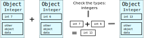

# Cython {.section}

# Cython

- Optimising static compiler for Python
- Extended Cython programming language
- Tune readable Python code into plain C performance by adding static
  type declarations
- Easy interfacing to external C/C++ libraries


# Python overheads

- Interpreting
- "Boxing" - everything is an object
- Function call overhead
- Global interpreter lock - no threading benefits (CPython)


# Interpreting

- Cython command generates a C/C++ source file from a Cython source file
- C/C++ source is then compiled into an extension module
- Interpreting overhead is normally not drastic

```python
from distutils.core import setup
from Cython.Build import cythonize

# Normally, one compiles cython extended code with .pyx ending
setup(ext_modules=cythonize("mandel_cyt.py"), )
```

```bash
$ python setup.py build_ext --inplace

In [1]: import mandel_cyt
```

# Case study: Mandelbrot fractal

- Pure Python: 5.55 s
- Compilation with Cython: 4.87 s
    - No interpretation but lots of calls to Python C-API 

<div class="column">

```python
def kernel(zr, zi, cr, ci, lim, cutoff):
    count = 0

    while ((zr*zr + zi*zi) < (lim*lim)) 
	        and count < cutoff:
        zr = zr * zr - zi * zi + cr
        zi = zr * zr - zi * zi + cr
        count += 1

    return count
```

</div>

<div class="column">

{.center width=80%}

</div>


# "Boxing"

- In Python, everything is an object

{.center width=90%}


# Static type declarations

- Cython extended code should have .pyx ending
    - Cannot be run with normal Python
- Types are declared with `cdef` keyword
    - In function signatures only type is given

<div class="column">

```python
def integrate(f, a, b, N):
    s = 0
    dx = (b - a) / N
    for i in range(N):
        s += f(a + i * dx)
    return s * dx
```

</div>
<div class="column">

```python
def integrate(f, double a, double b, int N):
    cdef double s = 0
    cdef int i
    cdef double dx = (b - a) / N
    for i in range(N):
        s += f(a + i * dx)
    return s * dx
```
</div>


# Static type declarations

- Pure Python: 5.55 s
- Static type declarations in kernel: 100 ms

<div class="column">

```python
def kernel(double zr, double zi, ...):
    cdef int count = 0

    while ((zr*zr + zi*zi) < (lim*lim)) 
	        and count < cutoff:
        zr = zr * zr - zi * zi + cr
        zi = zr * zr - zi * zi + cr
        count += 1

    return count
```

</div>

<div class="column">

{.center width=80%}

</div>


# Function call overhead

- Function calls in Python can involve lots of checking and "boxing"
- Overhead can be reduced by declaring functions to be C-functions
    - **cdef** keyword: functions can be called only from Cython
    - **cpdef** keyword: generate also Python wrapper 

<div class="column">
```python
def integrate(f, a, b, N):
    s = 0
    dx = (b - a) / N
    for i in range(N):
        s += f(a + i * dx)
    return s * dx
```

</div>
<div class="column">

```python
cdef double integrate(f, double a, ...):
    cdef double s = 0
    cdef int i
    cdef double dx = (b - a) / N
    for i in range(N):
        s += f(a + i * dx)
    return s * dx
```
</div>


# Using C functions

- Static type declarations in kernel: 100 ms
- Kernel as C function: 69 ms

<div class="column">

```python
cdef int kernel(double zr, double zi, ...):
    cdef int count = 0
    while ((zr*zr + zi*zi) < (lim*lim)) 
	        and count < cutoff:
        zr = zr * zr - zi * zi + cr
        zi = zr * zr - zi * zi + cr
        count += 1
    return count
```

</div>

<div class="column">

{.center width=80%}

</div>


# NumPy arrays with Cython

- Cython supports fast indexing for NumPy arrays
- Type and dimensions of array have to be declared

```python
import numpy as np    # normal NumPy import
cimport numpy as cnp  # import for NumPY C-API

def func(): # declarations can be made only in function scope
    cdef cnp.ndarray[cnp.int_t, ndim=2] data
    data = np.empty((N, N), dtype=int)

    ...

    for i in range(N):
        for j in range(N):
            data[i,j] = ... # double loop is done in nearly C speed
```


# Compiler directives

- Compiler directives can be used for turning of certain Python features
  for additional performance
    - boundscheck (False) : assume no IndexErrors
    - wraparound (False): no negative indexing
    - ...

```python
import numpy as np    # normal NumPy import
cimport numpy as cnp  # import for NumPY C-API

import cython

@cython.boundscheck(False)
def func(): # declarations can be made only in function scope
    cdef cnp.ndarray[cnp.int_t, ndim=2] data
    data = np.empty((N, N), dtype=int)
```


# Final performance

- Pure Python: 5.5 s
- Static type declarations: 100 ms
- Kernel as C function: 69 ms
- Fast indexing and directives: 15 ms


# Where to add types?

- Typing everything reduces readibility and can even slow down the
  performance
- Profiling should be first step when optimising
- Cython is able to provide annotated HTML-report
- Lines are colored according to the level of "typedness"
    - white lines translate to pure C
    - lines that require the Python C-API are yellow (darker as they
    translate to more C-API interaction)

```bash
$ cython -a cython_module.pyx
$ firefox cython_module.html
```


# HTML-report 

{.center width=80%}

# Profiling Cython code

- By default, Cython code does not show up in profile produced by
  cProfile
- Profiling can be enabled for entire source file or on per function
  basis

```python
# cython: profile=True
import cython

@cython.profile(False)
cdef func():
    ...
```

```python
# cython: profile=False
import cython

@cython.profile(True)
cdef func():
    ...
```


# Summary

- Cython is optimising static compiler for Python
- Possible to add type declarations with Cython language
- Fast indexing for NumPy arrays
- At best cases, huge speed ups can be obtained
    - Some compromise for Python flexibility


# Further functionality in Cython

- Using C structs and C++ classes in Cython
- Exceptions handling
- Parallelisation (threading) with Cython
- ...


# Interfacing external libraries {.section}

# Increasing performance with compiled code

- There are Python interfaces for many high performance libraries
- However, sometimes one might want to utilize a library without Python
  interface
    - Existing libraries
    - Own code written in C or Fortran
- Python C-API provides the most comprehensive way to extend Python
- CFFI, Cython, and f2py can provide easier approaches


# CFFI

- C Foreign Function Interface for Python
- Interact with almost any C code
- C-like declarations within Python
    - Can often be copy-pasted from headers / documentation
- ABI and API modes
    - ABI does not require compilation
    - API can be faster and more robust
    - Only API discussed here
- Some understanding of C required


# Creating Python interface to C library

- In API mode, CFFI is used for building a Python extension module
that provides interface to the library
- One needs to write a *build* script that specifies: 
    - the library functions to be interfaced
	- name of the Python extension
	- instructions for compiling and linking
- CFFI uses C compiler and creates the shared library
- The extension module can then be used from Python code.
  
# Example: Python interface to C math library
  

```python
from cffi import FFI
ffibuilder = FFI()

ffibuilder.cdef("""
    double sqrt(double x);  // list all the function prototypes from the
    double sin(double x);   // library that we want to use
                """)

ffibuilder.set_source("_my_math",  # name of the Python extension
"""
     #include <math.h>   // Some C source, often just include
""",
   library_dirs = [],  # location of library, not needed for C 
                       # C standard library 
   libraries = ['m']   # name of the library we want to interface
)

ffibuilder.compile(verbose=True)
```

# Example: Python interface to C math library

- Building the extension

```bash
python3 build_mymath.py
generating ./_mymath.c
running build_ext
building '_mymath' extension
...
gcc -pthread -shared -Wl,-z,relro -g ./_mymath.o -L/usr/lib64 -lm -lpython3.6m
-o ./_mymath.cpython-36m-x86_64-linux-gnu.so
```

- Using the extension

```python
from _mymath import lib

a = lib.sqrt(4.5)
b = lib.sin(1.2)
```

- Python `float`s are automatically converted to C `double`s and back

# Passing NumPy arrays to C code

- Only simple scalar numbers can be automatically converted Python
  objects and C types
- In C, arrays are passed to functions as pointers
- A "pointer" object to NumPy array can be obtained with `cast`
  and `from_buffer` functions

# Passing NumPy arrays to C code

<div class="column">
- C function adding two arrays

```c
// c = a + b
void add(double *a, double *b, double *c, int n)
{
  for (int i=0; i<n; i++)
     c[i] = a[i] + b[i];
}
```

- Can be built into extension `add_module` with CFFI

</div>

<div class="column">
- Obtaining "pointers" in Python

```python
from add_module import ffi, lib

a = np.random.random((1000000,1))
aptr = ffi.cast("double *", ffi.from_buffer(a))
...

lib.add(aptr, bptr, cptr, len(a))
```

- "pointer" objects resemble C pointers and can result easily in
Segmentation faults!
</div>


# Summary

- External libraries can be interfaced in various ways
- CFFI provides easy interfacing to C libraries
    - System libraries and user libraries
    - Python can take care of some datatype conversions
	- "pointer" objects are needed for NumPy arrays
