# Message Passing Interface {.section}

# Message passing interface

- MPI is an application programming interface (API) for communication
  between separate processes
- MPI programs are portable and scalable
    - the same program can run on different types of computers, from PC's
      to supercomputers
    - the most widely used approach for distributed parallel computing
- MPI is flexible and comprehensive
    - large (over 300 procedures)
    - concise (often only 6 procedures are needed)
- MPI standard defines C and Fortran interfaces
    - MPI for Python (mpi4py) provides an unofficial Python interface


# Processes and threads

{.center width=80%}


<div class="column">

## Process

- Independent execution units
- Have their own state information and *own memory* address space

</div>
<div class="column">

## Thread

- A single process may contain multiple threads
- Have their own state information, but *share* the *same memory*
  address space

</div>


# Execution model

- MPI program is launched as a set of *independent*, *identical processes*
    - execute the same program code and instructions
    - can reside in different nodes (or even in different computers)
- The way to launch a MPI program depends on the system
    - mpiexec, mpirun, srun, aprun, ...
    - mpiexec/mpirun in training class
    - srun on puhti.csc.fi


# MPI rank

- Rank: ID number given to a process
    - it is possible to query for rank
    - processes can perform different tasks based on their rank

```python
if (rank == 0):
    # do something
elif (rank == 1):
    # do something else
else:
    # all other processes do something different
```


# Data model

- Each MPI process has its own *separate* memory space, i.e. all
  variables and data structures are *local* to the process
- Processes can exchange data by sending and receiving messages

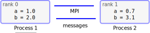{.center width=90%}


# MPI communicator

- Communicator: a group containing all the processes that will participate
  in communication
    - in mpi4py most MPI calls are implemented as methods of a
    communicator object
    - `MPI_COMM_WORLD` contains all processes (`MPI.COMM_WORLD` in
    mpi4py)
    - user can define custom communicators


# Routines in MPI for Python

- Communication between processes
    - sending and receiving messages between two processes
    - sending and receiving messages between several processes
- Synchronization between processes
- Communicator creation and manipulation
- Advanced features (e.g. user defined datatypes, one-sided communication
  and parallel I/O)


# Getting started

- Basic methods of communicator object
    - `Get_size()` Number of processes in communicator
    - `Get_rank()` rank of this process

```python
from mpi4py import MPI

comm = MPI.COMM_WORLD # communicator object containing all processes

size = comm.Get_size()
rank = comm.Get_rank()

print("I am rank %d in group of %d processes" % (rank, size))
```


# Running an example program

```bash
$ mpiexec -n 4 python3 hello.py

I am rank 2 in group of 4 processes
I am rank 0 in group of 4 processes
I am rank 3 in group of 4 processes
I am rank 1 in group of 4 processes
```

```python
from mpi4py import MPI

comm = MPI.COMM_WORLD # communicator object containing all processes

size = comm.Get_size()
rank = comm.Get_rank()

print("I am rank %d in group of %d processes" % (rank, size))
```


# Point-to-Point Communication {.section}

# MPI communication

<div class="column">

- Data is local to the MPI processes
    - They need to *communicate* to coordinate work
- Point-to-point communication
    - Messages are sent between two processes
- Collective communication
    - Involving a number of processes at the same time

</div>

<div class="column">

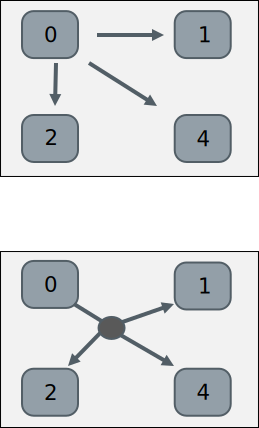{.center width=50%}

</div>


# MPI point-to-point operations

- One process *sends* a message to another process that *receives* it
- Sends and receives in a program should match - one receive per send
- Each message contains
    - The actual *data* that is to be sent
    - The *datatype* of each element of data
    - The *number of elements* the data consists of
    - An identification number for the message (*tag*)
    - The ranks of the *source* and *destination* process
- With **mpi4py** it is often enough to specify only *data* and
  *source* and *destination*

# Sending and receiving data

- Sending and receiving a dictionary

```python
from mpi4py import MPI

comm = MPI.COMM_WORLD # communicator object containing all processes
rank = comm.Get_rank()

if rank == 0:
    data = {'a': 7, 'b': 3.14}
    comm.send(data, dest=1)
elif rank == 1:
    data = comm.recv(source=0)
```


# Sending and receiving data

- Arbitrary Python objects can be communicated with the send and
  receive methods of a communicator

<div class="column">

`.send(data, dest)`
  : `data`{.input}
    : Python object to send

    `dest`{.input}
    : destination rank

</div>
<div class="column">

`.recv(source)`
  : `source`{.input}
    : source rank
    : note: data is provided as return value

</div>

- Destination and source ranks have to match!


# Blocking routines & deadlocks

- `send()` and `recv()` are *blocking* routines
    - the functions exit only once it is safe to use the data (memory)
    involved in the communication
- Completion depends on other processes => risk for *deadlocks*
    - for example, if all processes call `recv()` there is no-one left to
    call a corresponding `send()` and the program is *stuck forever*


# Typical point-to-point communication patterns

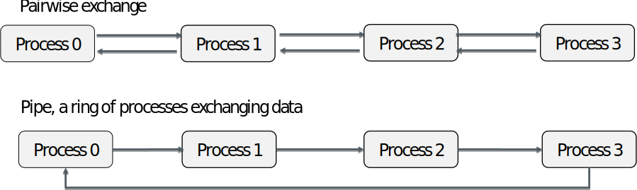{.center width=100%}

<br>

- Incorrect ordering of sends and receives may result in a deadlock


# Case study: parallel sum

<div class=column style="width:30%">
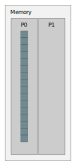{.center width=70%}
</div>

<div class=column style="width:68%">
## Initial state

An array A containing floating point numbers read from a a file by the first
MPI task (rank 0).

## Goal

Calculate the total sum of all elements in array A in parallel.
</div>


# Case study: parallel sum

<div class=column style="width:30%">
{.center width=70%}
</div>

<div class=column style="width:68%">
## Parallel algorithm

<pre style="border:none; margin-top:1em; font-size:1em">
1. Scatter the data
   1.1. receive operation for scatter
   1.2. send operation for scatter
2. Compute partial sums in parallel
3. Gather the partial sums
   3.1. receive operation for gather
   3.2. send operation for gather
4. Compute the total sum
</pre>

</div>


# Step 1.1: Receive operation for scatter

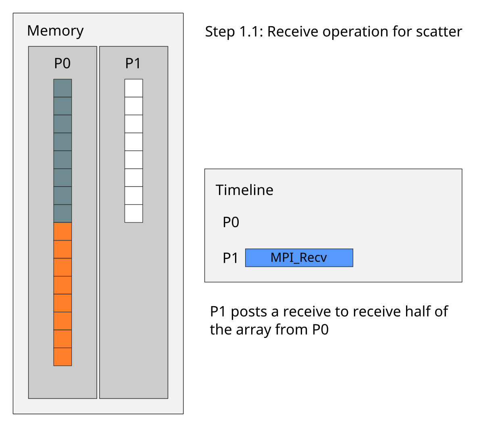{.center width=55%}


# Step 1.2: Send operation for scatter

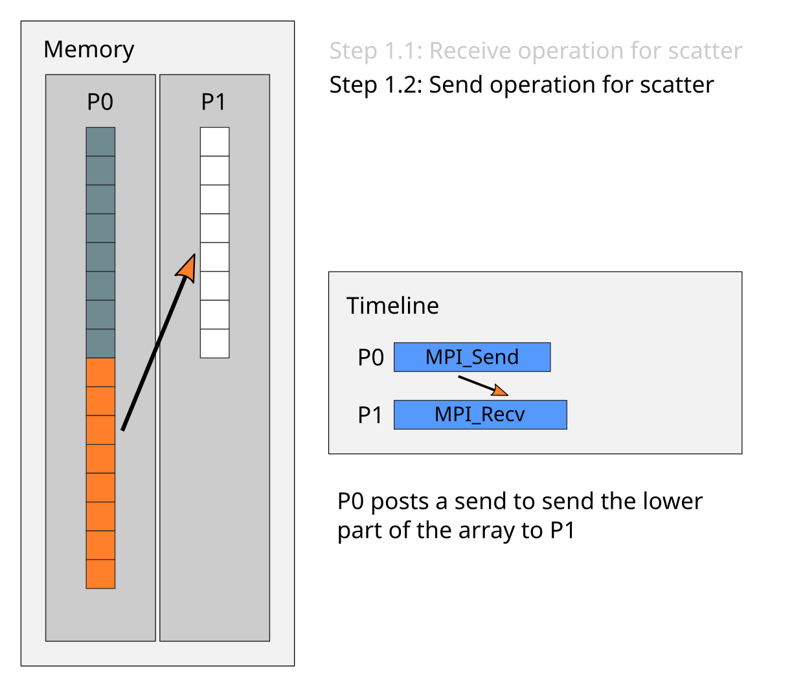{.center width=55%}


# Step 2: Compute partial sums in parallel

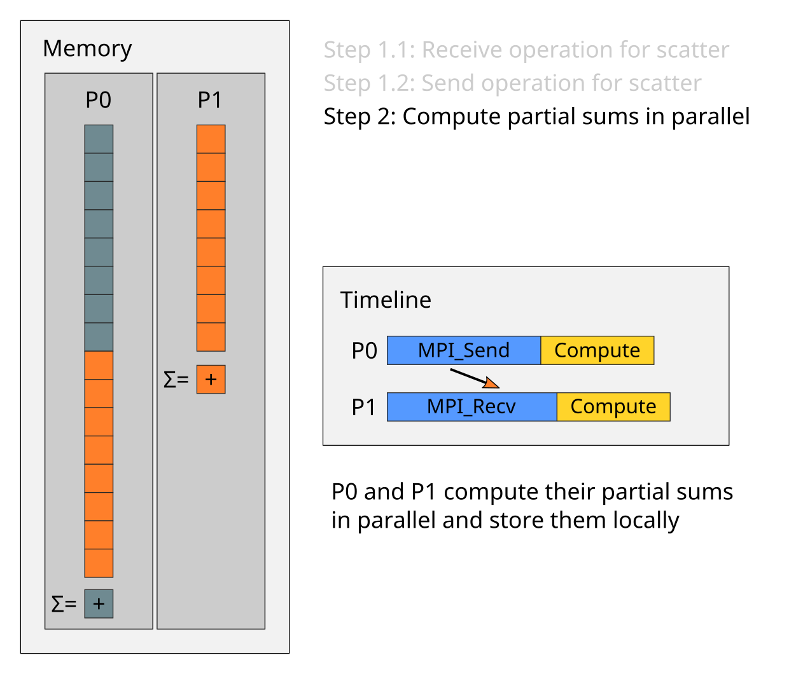{.center width=55%}


# Step 3.1: Receive operation for gather

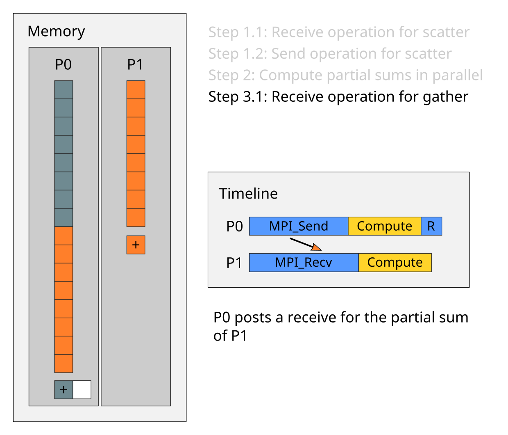{.center width=55%}


# Step 3.2: Send operation for gather

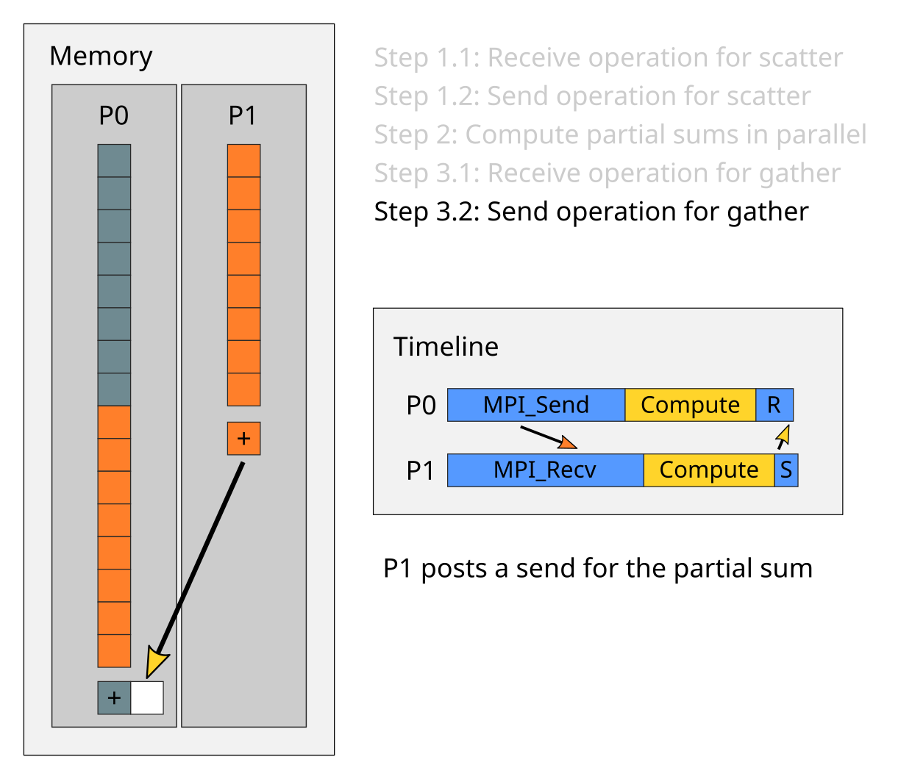{.center width=55%}


# Step 4: Compute the total sum

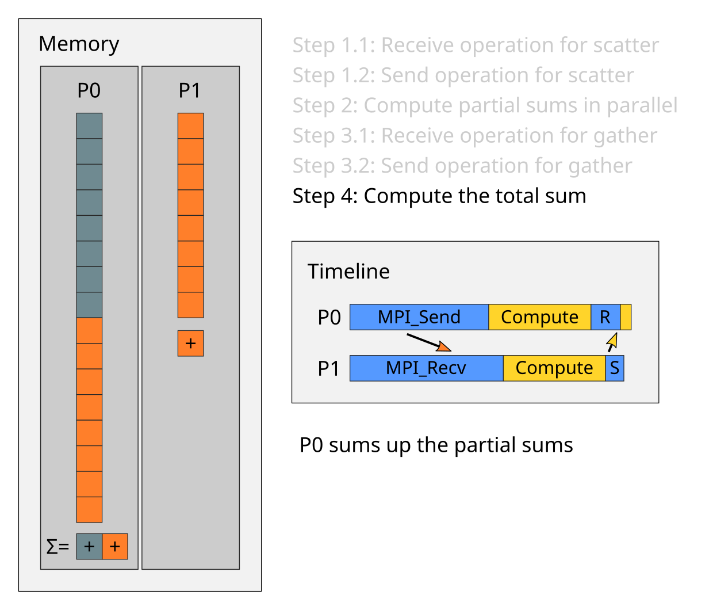{.center width=55%}


# Communicating NumPy arrays

- Arbitrary Python objects are converted to byte streams (pickled) when
  sending and back to Python objects (unpickled) when receiving
    - these conversions may be a serious overhead to communication
- Contiguous memory buffers (such as NumPy arrays) can be communicated
  with very little overhead using upper case methods:
    - `Send(data, dest)`
    - `Recv(data, source)`
    - note the difference in receiving: the data array has to exist at the
      time of call


# Send/receive a NumPy array

- Note the difference between upper/lower case!
    - send/recv: general Python objects, slow
    - Send/Recv: continuous arrays, fast

```python
from mpi4py import MPI
import numpy

comm = MPI.COMM_WORLD
rank = comm.Get_rank()

data = numpy.empty(100, dtype=float)
if rank == 0:
    data[:] = numpy.arange(100, dtype=float)
    comm.Send(data, dest=1)
elif rank == 1:
    comm.Recv(data, source=0)
```


# Combined send and receive

- Send one message and receive another with a single command
    - reduces risk for deadlocks
- Destination and source ranks can be same or different
    - `MPI.PROC_NULL` can be used for *no destination/source*

```python
data = numpy.arange(10, dtype=float) * (rank + 1)
buffer = numpy.empty(data.shape, dtype=data.dtype)

if rank == 0:
    dest, source = 1, 1
elif rank == 1:
    dest, source = 0, 0

comm.Sendrecv(data, dest=dest, recvbuf=buffer, source=source)
```


# MPI datatypes

- MPI has a number of predefined datatypes to represent data
    - e.g. `MPI.INT` for integer and `MPI.DOUBLE` for float
- No need to specify the datatype for Python objects or Numpy arrays
    - objects are serialised as byte streams
    - automatic detection for NumPy arrays
- If needed, one can also define custom datatypes
    - for example to use non-contiguous data buffers

# Summary

- Point-to-point communication = messages are sent between two MPI
  processes
- Point-to-point operations enable any parallel communication pattern (in
  principle)
- Arbitrary Python objects (that can be pickled!)
    - `send` / `recv`
    - `sendrecv`
- Memory buffers such as Numpy arrays
    - `Send` / `Recv`
    - `Sendrecv`


# Non-blocking Communication {.section}

# Non-blocking communication

- Non-blocking sends and receives
    - `isend` & `irecv`
    - returns immediately and sends/receives in background
    - return value is a Request object
- Enables some computing concurrently with communication
- Avoids many common dead-lock situations


# Non-blocking communication

- Have to finalize send/receive operations
    - `wait()`
        - Waits for the communication started with `isend` or `irecv` to
          finish (blocking)
    - `test()`
        - Tests if the communication has finished (non-blocking)
- You can mix non-blocking and blocking p2p routines
    - e.g., receive `isend` with `recv`


# Example: non-blocking send/receive

```python
rank = comm.Get_rank()
size = comm.Get_size()

if rank == 0:
    data = arange(size, dtype=float) * (rank + 1)
    req = comm.Isend(data, dest=1)    # start a send
    calculate_something(rank)         # .. do something else ..
    req.wait()                        # wait for send to finish
    # safe to read/write data again

elif rank == 1:
    data = empty(size, float)
    req = comm.Irecv(data, source=0)  # post a receive
    calculate_something(rank)         # .. do something else ..
    req.wait()                        # wait for receive to finish
    # data is now ready for use
```


# Multiple non-blocking operations

- Methods `waitall()` and `waitany()` may come handy when dealing with
  multiple non-blocking operations (available in the `MPI.Request` class)
    - `Request.waitall(requests)`
        - wait for all initiated requests to complete
    - `Request.waitany(requests)`
        - wait for any initiated request to complete
- For example, assuming `requests` is a list of request objects, one can wait
  for all of them to be finished with:

~~~python
MPI.Request.waitall(requests)
~~~


# Example: non-blocking message chain

<small>

~~~python
from mpi4py import MPI
import numpy

comm = MPI.COMM_WORLD
rank = comm.Get_rank()
size = comm.Get_size()

data = numpy.arange(10, dtype=float) * (rank + 1)  # send buffer
buffer = numpy.zeros(10, dtype=float)              # receive buffer

tgt = rank + 1
src = rank - 1
if rank == 0:
    src = MPI.PROC_NULL
if rank == size - 1:
    tgt = MPI.PROC_NULL

req = []
req.append(comm.Isend(data, dest=tgt))
req.append(comm.Irecv(buffer, source=src))

MPI.Request.waitall(req)
~~~

</small>


# Overlapping computation and communication

<div class="column">
~~~python
request_in = comm.Irecv(ghost_data)
request_out = comm.Isend(border_data)

compute(ghost_independent_data)
request_in.wait()

compute(border_data)
request_out.wait()
~~~
</div>

<div class="column">
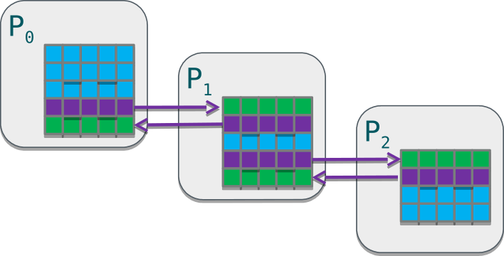
</div>


# Summary

- Non-blocking communication is usually the smart way to do point-to-point
  communication in MPI
- Non-blocking communication realization
    - `isend` / `Isend`
    - `irecv` / `Irecv`
    - `request.wait()`


# Communicators {.section}

# Communicators

- The communicator determines the "communication universe"
    - The source and destination of a message is identified by process rank
      *within* the communicator
- So far: `MPI.COMM_WORLD`
- Processes can be divided into subcommunicators
    - Task level parallelism with process groups performing separate tasks
    - Collective communication within a group of processes
    - Parallel I/O


# Communicators

<div class="column">
- Communicators are dynamic
- A task can belong simultaneously to several communicators
    - Unique rank in each communicator
</div>
<div class="column">
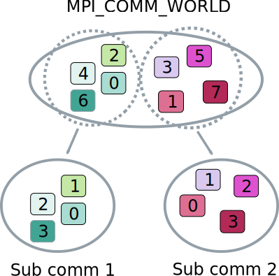{.center width=80%}
</div>


# User-defined communicators

- By default a single, universal communicator exists to which all
  processes belong (`MPI.COMM_WORLD`)
- One can create new communicators, e.g. by splitting this into
  sub-groups

```python
comm = MPI.COMM_WORLD
rank = comm.Get_rank()

color = rank % 4

local_comm = comm.Split(color)
local_rank = local_comm.Get_rank()

print("Global rank: %d Local rank: %d" % (rank, local_rank))
```


# Collective Communication {.section}

# Collective communication

- Collective communication transmits data among all processes in a process
  group (communicator)
    - these routines must be called by all the processes in the group
    - amount of sent and received data must match
- Collective communication includes
    - data movement
    - collective computation
    - synchronization
- Example
    - `comm.barrier()` makes every task hold until all tasks in the
      communicator `comm` have called it


# Collective communication

- Collective communication typically outperforms point-to-point
  communication
- Code becomes more compact (and efficient!) and easier to maintain:
    - For example, communicating a Numpy array of 1M elements from task 0 to all
      other tasks:

<div class="column">

```python
if rank == 0:
    for i in range(1, size):
    comm.Send(data, i)
else:
    comm.Recv(data, 0)
```

</div>
<div class="column">

```python
comm.Bcast(data, 0)
```

</div>


# Broadcast

- Send the same data from one process to all the other

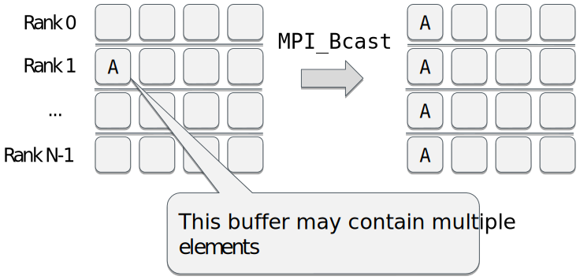{.center width=80%}


# Broadcast

- Broadcast sends same data to all processes

```python
from mpi4py import MPI
import numpy

comm = MPI.COMM_WORLD
rank = comm.Get_rank()

if rank == 0:
    py_data = {'key1' : 0.0, 'key2' : 11}  # Python object
    data = np.arange(8) / 10.              # NumPy array
else:
    py_data = None
    data = np.zeros(8)

new_data = comm.bcast(py_data, root=0)

comm.Bcast(data, root=0)
```


# Scatter

- Send equal amount of data from one process to others
- Segments A, B, ... may contain multiple elements

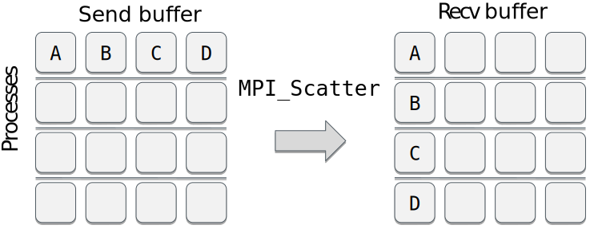{.center width=80%}


# Scatter

- Scatter distributes data to processes

```python
from mpi4py import MPI
from numpy import arange, empty

comm = MPI.COMM_WORLD
rank = comm.Get_rank()
size = comm.Get_size()
if rank == 0:
    py_data = range(size)
    data = arange(size**2, dtype=float)
else:
    py_data = None
    data = None

new_data = comm.scatter(py_data, root=0)  # returns the value

buffer = empty(size, float)         # prepare a receive buffer
comm.Scatter(data, buffer, root=0)  # in-place modification
```


# Gather

- Collect data from all the process to one process
- Segments A, B, ... may contain multiple elements

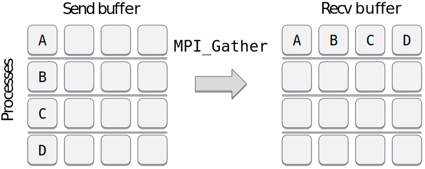{.center width=80%}


# Gather

- Gather pulls data from all processes

```python
from mpi4py import MPI
from numpy import arange, zeros

comm = MPI.COMM_WORLD
rank = comm.Get_rank()
size = comm.Get_size()

data = arange(10, dtype=float) * (rank + 1)
buffer = zeros(size * 10, float)

n = comm.gather(rank, root=0)     # returns the value
comm.Gather(data, buffer, root=0) # in-place modification
```


# Reduce

- Applies an operation over set of processes and places result in
  single process

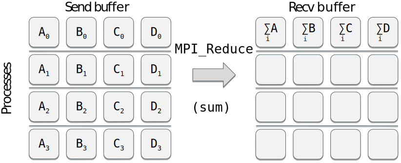{.center width=80%}

# Reduce

- Reduce gathers data and applies an operation on it

```python
from mpi4py import MPI
from numpy import arange, empty

comm = MPI.COMM_WORLD
rank = comm.Get_rank()
size = comm.Get_size()

data = arange(10 * size, dtype=float) * (rank + 1)
buffer = zeros(size * 10, float)

n = comm.reduce(rank, op=MPI.SUM, root=0)     # returns the value
comm.Reduce(data, buffer, op=MPI.SUM, root=0) # in-place modification
```


# Other common collective operations

Scatterv
  : each process receives different amount of data

Gatherv
  : each process sends different amount of data

Allreduce
  : all processes receive the results of reduction

Alltoall
  : each process sends and receives to/from each other

Alltoallv
  : each process sends and receives different amount of data


# Non-blocking collectives

- New in MPI 3: no support in mpi4py
- Non-blocking collectives enable the overlapping of communication and
  computation together with the benefits of collective communication
- Restrictions
    - have to be called in same order by all ranks in a communicator
    - mixing of blocking and non-blocking collectives is not allowed


# Common mistakes with collectives

1. Using a collective operation within one branch of an if-else test based on
   the rank of the process
    - for example: `if rank == 0: comm.bcast(...)`
    - all processes in a communicator must call a collective routine!
2. Assuming that all processes making a collective call would complete at
   the same time.
3. Using the input buffer also as an output buffer:
    - for example: `comm.Scatter(a, a, MPI.SUM)`
    - always use different memory locations (arrays) for input and output!


# Summary

- Collective communications involve all the processes within a
  communicator
    - all processes must call them
- Collective operations make code more transparent and compact
- Collective routines allow optimizations by MPI library
- MPI-3 contains also non-blocking collectives, but these are currently
  not supported by MPI for Python


# On-line resources

- Documentation for mpi4py is quite limited
    - short on-line manual available at
    [https://mpi4py.readthedocs.io/](https://mpi4py.readthedocs.io/)
- Some good references:
    - "A Python Introduction to Parallel Programming with MPI" *by Jeremy
      Bejarano* [http://materials.jeremybejarano.com/MPIwithPython/](http://materials.jeremybejarano.com/MPIwithPython/)
    - "mpi4py examples" *by Jörg Bornschein* [https://github.com/jbornschein/mpi4py-examples](https://github.com/jbornschein/mpi4py-examples)


# Summary

- mpi4py provides Python interface to MPI
- MPI calls via communicator object
- Possible to communicate arbitrary Python objects
- NumPy arrays can be communicated with nearly same speed as in C/Fortran
