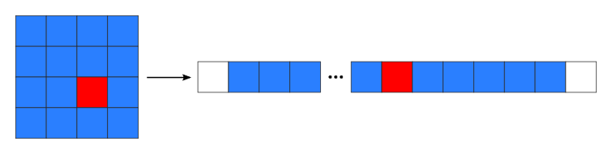
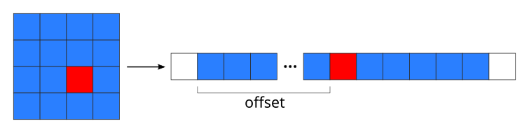

<!-- Title: Anatomy of NumPy arrays -->

<!-- Short description:

In this article we look more deeply into the internals of NumPy arrays.

-->

# Anatomy of NumPy arrays

The datatype of a NumPy array is called **ndarray**. If one looks into what an
**ndarray** is actually made of, one can see that it consists of the following:
  - one dimensional contiguous block of memory: raw data
  - indexing scheme: how to locate an element
  - data type descriptor: how to interpret an element

## NumPy indexing

There are many possible ways of arranging the elements of a N-dimensional
array in a 1-dimensional block (i.e. memory). NumPy uses **striding** where a
N-dimensional index (n[0], n[1], ..., n[-1]) corresponds to the offset from
the beginning of a 1-dimensional block.

If n[k] is the index in dimension k for an element and s[k] is the stride in
that dimension, then the offset for an element is:

~~~python
offset = sum(s[k] * n[k] for k in range(N))
~~~

When one assigns a variable to a slice

~~~python
b = a[1:8:2, 3:12:3]
~~~

the variable `b` has the same raw data as `a`, but only different
strides. Thus, changing the contents of `b` will also change the contents of
`a`, i.e. `b` is view to `a` as discussed earlier.

In addition to slicing NumPy allows indexing also with integer arrays or
Boolean masks:

~~~python
a = np.arange(0.0, 1.0, 0.1)
ind = np.array([1, 1, 0, 4])
b = a[ind] # b = array([0.1, 0.1, 0. , 0.4])

m = a > 0.5
b = a[m] # b = array([0.6, 0.7, 0.8, 0.9])
~~~

In these cases `b` cannot be created just by modifying the strides, so `b` 
will hold a copy of the data in `a`. Now, modifications of `b` are not
affecting `a`.

## Attributes of an ndarray

`a = np.array(...)`
  : `a.flags`
    : various information about memory layout

    `a.strides`
    : bytes to step in each dimension when traversing

    `a.itemsize`
    : size of one array element in bytes

    `a.data`
    : Python buffer object pointing to start of arrays data

    `a.__array_interface__`
    : Python internal interface
