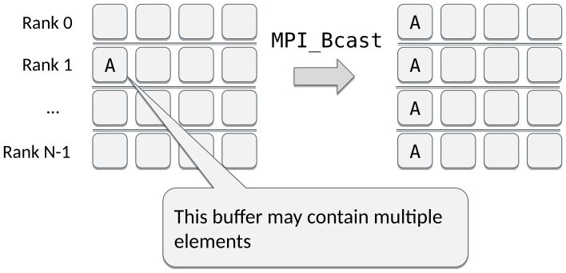
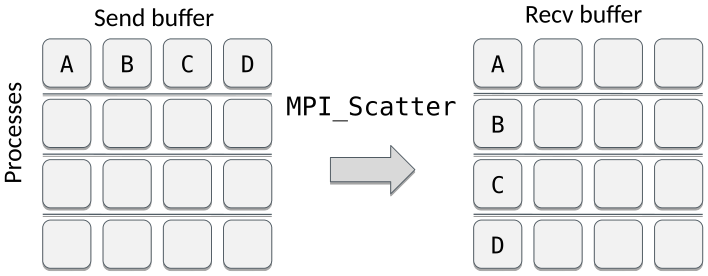

<!-- Title: Collective communication: one to many -->

<!-- Short description:

In this article we discuss how to use collective communication to distribute
data from one task to all the others.

-->

# Collective communication: one to many

Collective communication transfers data between all the processes in a
communicator. MPI includes collective communication routines not only for
data movement, but also for collective computation and synchronisation. For
example, the often used MPI barrier (`comm.barrier()`) makes every task hold
until all tasks in the communicator `comm` have called it.

Since these routines are *collective*, they **must be called by all the
processes in the communicator**. Also, the amount of data sent and received
must match.

Advantages of using collective communication over sending and receiving
individual messages (i.e. point-to-point communication) are clear. Code
becomes more compact and easier to maintain, which is a major bonus for us
humans. Collective communication also typically outperforms point-to-point
communication, which gives an additional computational benefit. Indeed,
collective communication is usually the smart way of doing MPI communication.

For example, communicating a numpy array of 1M elements from task 0 to all
the other tasks is simplified from something like this:

~~~python
if rank == 0:
    for i in range(1, size):
        comm.Send(data, i)
else:
    comm.Recv(data, 0)
~~~

into a single line of code:

~~~python
comm.Bcast(data, 0)
~~~

Let us first look into how to use collective communication to distribute data
from one task to all the other tasks, i.e. how to move data from *one to many*.

## Broadcast

Broadcast sends the same data from one process to all the other processes. In
effect, it replicates the data to all processes, so that they all have it
available locally.

An example of broadcasting a dictionary and a numpy array:

~~~python
from mpi4py import MPI
import numpy

comm = MPI.COMM_WORLD
rank = comm.Get_rank()

if rank == 0:
    py_data = {'key1' : 0.0, 'key2' : 11}  # Python object
    data = numpy.arange(8) / 10.              # numpy array
else:
    py_data = None
    data = numpy.zeros(8)

new_data = comm.bcast(py_data, root=0)
comm.Bcast(data, root=0)
~~~

## Scatter

Scatter sends an equal amount of data from one process to all the other
processes. It allows one to distribute data equally among the processes.

Segments A, B, etc. may contain multiple elements.

An example of scattering a list of numbers (one number to each task) and a
numpy array (multiple elements to each task):

~~~python
from mpi4py import MPI
from numpy import arange, empty

comm = MPI.COMM_WORLD
rank = comm.Get_rank()
size = comm.Get_size()
if rank == 0:
    py_data = range(size)
    data = arange(size**2, dtype=float)
else:
    py_data = None
    data = None

new_data = comm.scatter(py_data, root=0)  # returns the value

buffer = empty(size, float)         # prepare a receive buffer
comm.Scatter(data, buffer, root=0)  # in-place modification
~~~
