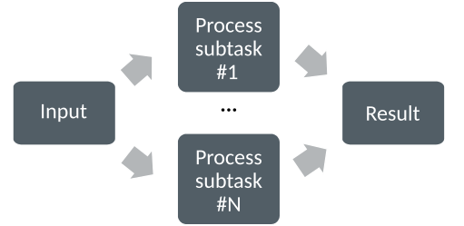
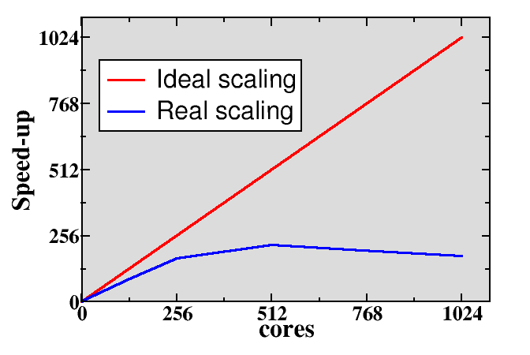

<!-- Title: Parallel programming concepts -->

<!-- Short description:

In this article we briefly introduce some key concepts related to parallel
programming.

-->

Before beginning to program for parallel computers, we need to start with few
basic concepts.

# Computing in parallel

The underlying idea in parallel computing is that the computational problem
can be split into smaller subtasks. Multiple subtasks can then be executed
*simultaneously* by multiple processing units. In modern CPUs, the single
execution unit is typically a CPU core.

How the splitting into subtasks is done depends fully on the problem. There
are various paradigms and programming approaches into the parallelization,
but in this course we focus on message passing approach using Python.

## Types of parallel problems

Parallel programs can be divided in two limiting classes: tightly coupled and 
embarrassingly parallel. In tightly coupled problems there is lots of
interaction between subtasks, and low latency high speed interconnect
between the CPUs is essential for good performance. Weather simulation
is a typical example of tightly coupled problem.

In embarrassingly parallel cases there is very little (or no)
interaction between subtasks. Programming these types of problems is
typically easier, and there are no high demands for the connection
between CPUs. In best cases computers all over internet can be used
for computing in parallel such as in the
[Folding@home](https://foldingathome.org/) project where protein 
folding is studied using personal computers all over world.

Many real-world problems fall naturally somewhere between the two extreme cases.

## Exposing parallelism

One common way to expose parallelism is by distributing the data, for example an
array, to individual processing units.

Each processing unit (e.g. CPU core) holds part of the data, and performs
typically identical or at least very similar operations on the data. Processing
units may need to interact with each other, for example exchange information 
about the data on the domain boundaries.

Other common parallelization model is the task farm (or master / worker) 
approach, where a master sends tasks to workers and receives then results 
from them.

The tasks can be computationally similar, but in some cases they can be also 
completely different. There are often more tasks than workers, and tasks are 
then dynamically assigned to workers.

Task farm and data parallel approaches can be also combined, for example, 
each worker could consist of multiple execution units, and the data related
to task is then distributed to them.

## Parallel scaling

When the size of the input data is kept constant, but one increases
the number of processing units, we typically speak about *strong
parallel scaling*. The purpose of parallel programming in this case is
to decrease the time to solve the problem. The relative parallel speed-up can
be defined as

$$
S_{rel}=\frac{T_p}{T_{p+1}},
$$

where $$T_p$$ is the execution time with $$p$$ processing units.

In ideal case the speed-up should be directly proportional to the
number of processing units, i.e. doubling the number of processing
units should give a relative speed-up of two. In real-world problems
this is rarely the case, and typically when increasing the processing
units enough the execution time can even start to increase, resulting
in relative speed-up which is smaller than one.

There are several factors which can limit the parallel scaling. Typically, 
parallel program needs to perform some additional operations which are not 
present in serial program. There can be some redundant computations, data needs
to be communicated, and the processing units need to be synchronized. If there
is imbalance in the distribution of the workload, execution time is limited
by the slowest execution unit, and others need to wait its completion. There 
can be also serial parts in the program i.e. parts that cannot be parallelized.
If we designate with $$p_f$$ the fraction of the problem that can be 
parallelized, then the maximum possible speed-up (so called Amdahl's law) is

$$
S_{max} = \frac{1}{1 - p_f}
$$

As an example, if only 90 % of the problem can be parallelized, maximum 
speed-up is 10 even if one was using 1000 CPU cores.

Parallel programming is not used only for speeding up problems, but also to
enable studies of larger or more accurate problems. In these situations, 
both the size of input data and number of processing units are increased at the
same time, and one speaks about *weak parallel scaling*. In ideal weak scaling
case the execution time remains constant when the amount of data and
the number of processing units are increased in same proportion. Good
weak scaling is easier to achieve than good strong scaling.
