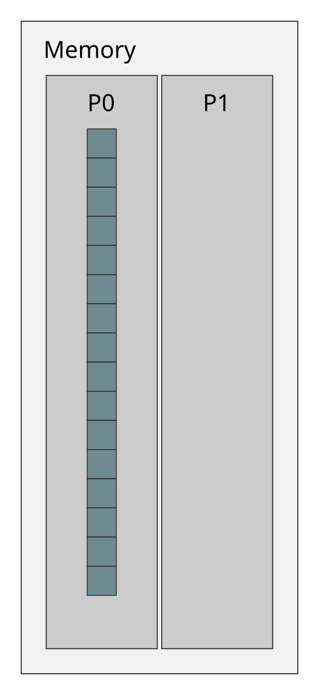

<!-- Title: Case study: Parallel sum -->

<!-- Short description:

In this article we walk through an example parallel algorithm that calculates
the total sum of all elements in an array in parallel.

-->

# Case study: parallel sum

How can a problem be split into smaller pieces that can be executed in
parallel? How to do it efficiently? These are the key questions when
designing a parallel algorithm.

Designing a good strategy for work distribution is usually the most essential
part of writing a parallel program. Common approaches utilise either data
parallelism or task parallelism. In *data parallelism* one distributes a
(large) dataset to multiple processors and then the processors operate on
separate pieces of the data in parallel. In *task parallelism* one breaks down
the algorithm into smaller tasks that are then distributed and executed in
parallel.

Let us now look into an example implementation of a parallel algorithm for
calculating the sum of all values in an array.

## Initial state

Assume we have an array A that contains a large number of floating point
numbers. The values have been read from a file by the first MPI task (rank 0).

## Goal

Calculate the total sum of all elements in array A in parallel.

## Parallel algorithm

Our parallel algorithm consist of four main steps: 1) distribute the data,
2) compute local sums, 3) gather the partial results, and 4) compute the total
sum. Steps 1 and 3 can be further broken down into sub-steps to better
illustrate the MPI communication needed.

~~~
1. Scatter the data
   1.1. receive operation for scatter
   1.2. send operation for scatter
2. Compute partial sums in parallel
3. Gather the partial sums
   3.1. receive operation for gather
   3.2. send operation for gather
4. Compute the total sum
~~~

### Step 1.1: Receive operation for scatter

### Step 1.2: Send operation for scatter

### Step 2: Compute partial sums in parallel

### Step 3.1: Receive operation for gather

### Step 3.2: Send operation for gather

### Step 4: Compute the total sum

