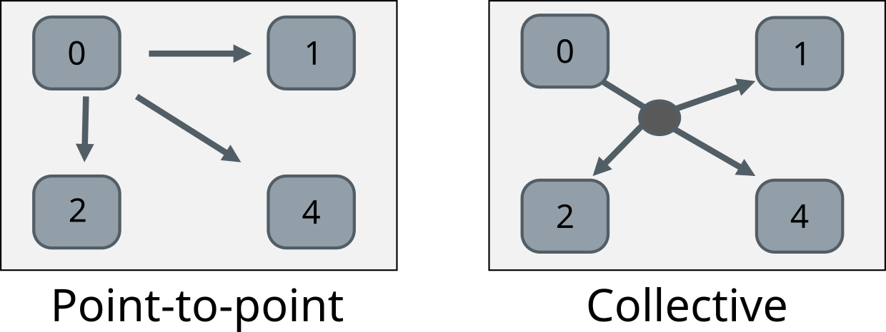
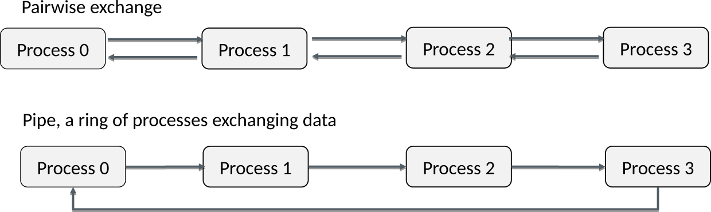

<!-- Title: MPI communication -->

<!-- Short description:

In this article we discuss how to send and receive Python objects using MPI.

-->

# MPI communication

Since MPI processes are independent, in order to coordinate work, they need to
communicate by explicitly sending and receiving messages. There are two types
of communication in MPI: point-to-point communication and collective
communication.

In point-to-point communication messages are sent between two processes,
whereas a collective communication involves a number of processes at the same
time. [Collective communication](one-to-many.md) will be discussed in more
detail later, but let us focus now on sending and receiving data between two
processes.

# Point-to-point communication

In a nutshell, in point-to-point communication one process *sends* a message
(some data) to another process that *receives* it. The important thing to
remember is that the sends and receives in a program have to match:
**one receive per one send**.

In addition to matching each send call with a corresponding receive call, one
needs to pay particular attention to match also the destination and source
ranks for the communication. A message is always sent to given process
(destination rank) and, similarly, received from a given process (source
rank). One can think of the destination and source ranks as the addresses for
the messages, i.e. "please send the message to this address" and "is there a
message coming from this address?".

## Example: Sending and receiving a dictionary

~~~python
from mpi4py import MPI

comm = MPI.COMM_WORLD
rank = comm.Get_rank()

if rank == 0:
    data = {'a': 7, 'b': 3.14}
    comm.send(data, dest=1)
elif rank == 1:
    data = comm.recv(source=0)
~~~

## Sending and receiving data

Python objects can be communicated with the `send()` and `recv()` methods
of a communicator. It works for any Python object that can be serialised into
a byte stream, i.e. any object that can be
[pickled](https://docs.python.org/3/library/pickle.html). This includes all
standard Python objects and most derived ones as well. The basic
interfaces (check mpi4py documentation for optional arguments) 
of the methods are: 

`.send(data, dest)`
  : `data`{.input}
    : Python object to send

    `dest` {.input}
    : destination rank

`.recv(source)`
  : `source`{.input}
    : source rank
    : note: data is provided as return value

The normal send and receive routines are *blocking*, i.e. the functions exit
only once it is safe to use the data (memory) involved in the communication.
This means that the completion depends on the other process and that there is
a risk of a *deadlock*. For example, if both processes call `recv()` first
there is no-one left to call a corresponding `send()` and the program is
stuck forever.

Typical point-to-point communication patterns are shown below. Incorrect
ordering of sends and receives may result in a deadlock.

