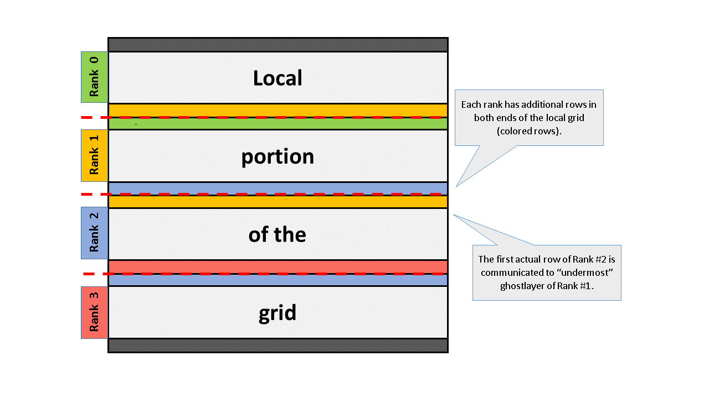

## Parallel heat equation

Parallelize the whole heat equation program with MPI, by dividing the grid in rows and assigning one row block to one task. A domain decomposition, that is.

The tasks are able to update the grid independently everywhere else than on the row boundaries – there the communication of a single row with the nearest neighbor is needed. This is realized by having additional ghost layers that contain the boundary data of the neighboring tasks. As the system is aperiodic, the outermost ranks communicate with single neighbor, and the inner ranks with the two neighbors.

Insert the proper MPI routines into skeleton code [skeleton.py](skeleton.py) (search for“TODO”s). 

A schematic representation of decomposition looks like

Remember to update all ghost layers at each iteration.
