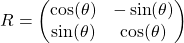

## Rotation with broadcasting

Two dimensional coordinates can be rotated by my multiplying the 2-element
vector of coordinates by 2x2 rotation matrix

<!--- Equation
R = 
\begin{pmatrix}
\cos(\theta) & -\sin(\theta) \\
\sin(\theta) & \cos(\theta) \\
\end{pmatrix}
--->

where θ is the angle of rotation (in radians). Start from the x-y coordinates
in the file points_circle.dat and rotate them by 90°. Utilize broadcasting for
performing the rotation with a single `np.dot` call. (Hint: you may need to
create additional dimensions). Plot both the original and rotated points in
order to see the effect of rotation.

