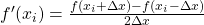

## Finite-difference

Vectorization is crucial for obtaining good performance with NumPy.

Derivatives can be calculated numerically with the finite-difference method
as:

<!--- Equation
f'(x_i) = \frac{f(x_i + \Delta x)- f(x_i - \Delta x)}{2 \Delta x}
--->

Construct 1D Numpy array containing the values of xi in the interval [0,π/2]
with spacing Δx=0.1. Evaluate numerically the derivative of **sin** in this
interval (excluding the end points) using the above formula. Try to avoid
`for` loops. Compare the result to function **cos** in the same interval.
