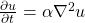
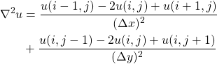
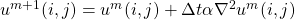
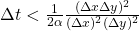

## Two dimensional heat equation

Heat (or diffusion) equation is

<!-- Equation
\frac{\partial u}{\partial t} = \alpha \nabla^2 u
--> 

where **u(x, y, t)** is the temperature field that varies in space and time,
and α is thermal diffusivity constant. The two dimensional Laplacian can be
discretized with finite differences as

<!-- Equation
\begin{align*}
\nabla^2 u  &= \frac{u(i-1,j)-2u(i,j)+u(i+1,j)}{(\Delta x)^2} \\
 &+ \frac{u(i,j-1)-2u(i,j)+u(i,j+1)}{(\Delta y)^2}
\end{align*}
--> 

Given an initial condition (u(t=0) = u0) one can follow the time dependence of
the temperature field with explicit time evolution method:

<!-- Equation
u^{m+1}(i,j) = u^m(i,j) + \Delta t \alpha \nabla^2 u^m(i,j) 
--> 

Note: Algorithm is stable only when

<!-- Equation
\Delta t < \frac{1}{2 \alpha} \frac{(\Delta x \Delta y)^2}{(\Delta x)^2 (\Delta y)^2}
-->

Implement two dimensional heat equation with NumPy using the initial
temperature field in the file [bottle.dat](bottle.dat) (the file consists of a
header and 200 x 200 data array). As a boundary condition use fixed values as
given in the initial field. The main program that is provided in
[heat_main.py](heat_main.py) can be used as such, implement the required 
functionality in the module [heat.py](heat.py) (look for **TODO**s).

