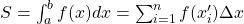
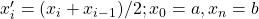

## Numerical integration

A simple method for evaluating integrals numerically is by the middle Riemann
sum

<!--- Equation
S = \int_a^b f(x) dx = \sum_{i=1}^n f(x'_i) \Delta x
--->

with

<!--- Equation
x'_i = (x_i + x_{i-1}) / 2; x_0 = a, x_n = b
--->

Calculate the integral in the interval [0,π/2] and investigate how much the
Riemann sum of **sin** differs from 1.0. Avoid `for` loops. Investigate also
how the results changes with the choice of Δx.
